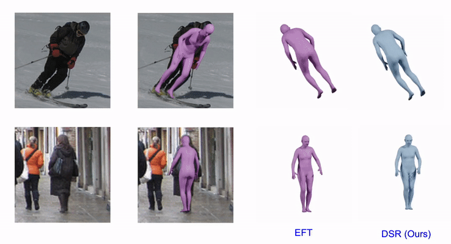

# [ICCV2021] Learning to Regress Bodies from Images using Differentiable Semantic Rendering

[](https://dsr.is.tue.mpg.de/)
[](https://arxiv.org/abs/2110.03480)


<p float="left">
  

</p>


## Getting Started

DSR has been implemented and tested on Ubuntu 18.04 with 
python 3.6.

Clone the repo:

```shell
git clone https://github.com/saidwivedi/DSR.git
```

Install the requirements using conda:

```shell
# conda
source scripts/install_conda.sh
```

## Preparation of Data

For evaluation, you need to download the pretrained DSR model and SMPL body models. Run the command following command
```shell command
source prepare_data.sh
```
For both evaluation and training, we use data processing techinque similar to [SPIN](https://github.com/nkolot/SPIN). Kindly refer to their repo for more details.

## Evaluation

For evaluating on [3DPW](https://virtualhumans.mpi-inf.mpg.de/3DPW/), [MPI-INF-3DHP](http://vcai.mpi-inf.mpg.de/3dhp-dataset/) and [Human3.6M](http://vision.imar.ro/human3.6m/description.php), run the following command
```shell
# Change the val_ds configuration for different datasets
python train.py --cfg configs/dsr_eval.cfg
```

## Training

For training, we use the off-the-self human parsing model [Graphonomy](https://github.com/Gaoyiminggithub/Graphonomy) to get pseudo ground truth clothing segmentation. Use the `Universal Model` of Graphonomy to generate the segmentation mask. After preparing the data, run the following command
```shell
# For more details on different parameters, refer to dsr/core/config.py
python train.py --cfg configs/dsr_train.cfg
```

## Citation

```bibtex
@inproceedings{Dwivedi_DSR_2021,
  title = {Learning To Regress Bodies From Images Using Differentiable Semantic Rendering},
  author = {Dwivedi, Sai Kumar and Athanasiou, Nikos and Kocabas, Muhammed and Black, Michael J.},
  booktitle = {Proc. International Conference on Computer Vision (ICCV)},
  pages = {11250--11259},
  month = oct,
  year = {2021},
  month_numeric = {10}
}
```

## License

This code is available for **non-commercial scientific research purposes** as defined in the [LICENSE file](LICENSE). By downloading and using this code you agree to the terms in the [LICENSE](LICENSE). Third-party datasets and software are subject to their respective licenses.

## References

Major part of the code is borrowed from [PARE](https://github.com/mkocabas/PARE).


## Contact

For questions, please contact dsr@tue.mpg.de

For commercial licensing (and all related questions for business applications), please contact ps-licensing@tue.mpg.de.


