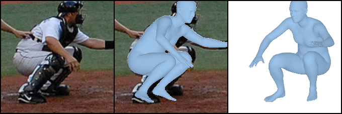

# [ICCV2021] Learning to Regress Bodies from Images using Differentiable Semantic Rendering

[](https://dsr.is.tue.mpg.de/)
[](https://arxiv.org/abs/2110.03480)


<p float="left">
  

</p>


## Getting Started

DSR has been implemented and tested on Ubuntu 18.04 with Python 3.6.

Clone the repo:

```shell
git clone https://github.com/saidwivedi/DSR.git
```

Install the requirements using conda:

```shell
# conda
source install_conda.sh
```

### Installing Renderer
For differentiable renderer, we use [SoftRas](https://github.com/ShichenLiu/SoftRas). Please follow the installation guidelines mentioned in the repo. Checkout to the `legacy` branch before starting the installation.

## Preparation of Data

Before proceeding, you need to download the required data for running the code. Run the following command
```shell command
source prepare_data.sh
```
The downloaded `dsr_data.zip` contains two pretrained DSR models - one without 3DPW training and one with 3DPW training. It also contains SMPL semantic prior - `semantic_prior.npy` which represents distribution of clothing labels per vertex on SMPL mesh, SMPL models, pre-processed 3DPW test data (for evaluation).

For evaluation on other datasets and training with 3D datasets, we use data processing techinque similar to [SPIN](https://github.com/nkolot/SPIN). Kindly refer to their repo for more details. For training with 2D in-the-wild data, we use psuedo ground-truth SMPL parameters of COCO from [EFT](https://github.com/facebookresearch/eft). Please download the required file from their repo.

The final folder structure should look like

```shell
dsr_data/
├── dataset_extras # Contains all pre-processed data
├── dataset_folders # Contains all datasets
│   ├── coco
│   │   ├── grph_sequences # Contains psuedo-GT Graphonomy Segmentation
│   │   └── ...
│   └── h36m
│   │   ├── grph_sequences # Contains psuedo-GT Graphonomy Segmentation
│   │   └── ...
│   └── ... # Other datasets
├── dsr_w3DPW_checkpoint.pt  # dsr_checkpoint with 3DPW training
├── dsr_wo3DPW_checkpoint.pt # dsr_checkpoint without 3DPW training
├── semantic_prior.npy # SMPL Semantic Prior
├── smpl 
│   └── ... # SMPL Models
└── ...
```


## Running Demo

For running the demo code, you need a tightly fit bounding box with person in the center. This can either be provided as bounding box json file in the format `[top_left(x), top_left(y), width, height]`, [Openpose](https://github.com/CMU-Perceptual-Computing-Lab/openpose) detection json or an image with person centered in it. An example with openpose json-
```shell
# Use --bbox for bounding box json
python demo.py --checkpoint dsr_data/dsr_w3DPW_checkpoint.pt --img examples/COCO_val_0544.jpg --openpose examples/COCO_val_0544_openpose.json
```
Running the above command should show result as below
<p float="left">
  

</p>

## Evaluation

For evaluating on [3DPW](https://virtualhumans.mpi-inf.mpg.de/3DPW/), [MPI-INF-3DHP](http://vcai.mpi-inf.mpg.de/3dhp-dataset/) and [Human3.6M](http://vision.imar.ro/human3.6m/description.php), run the following command. Change the `val_ds` in the `dsr_eval.cfg` file to run respective dataset. See `dsr/core/config.py` for naming convention of the datasets.
```shell
# Change the val_ds configuration for different datasets
python train.py --cfg configs/dsr_eval.cfg
```

## Training

For training, we use the off-the-self human parsing model [Graphonomy](https://github.com/Gaoyiminggithub/Graphonomy) to get pseudo ground truth clothing segmentation. Use the `Universal Model` of Graphonomy to generate the segmentation mask. Read the supplementary paper for more information on how to generate psuedo ground-truth. After preparing the data, run the following command
```shell
# For more details on different parameters, refer to dsr/core/config.py
python train.py --cfg configs/dsr_train.cfg
```

## References

1. Major part of the code is borrowed from [PARE](https://github.com/mkocabas/PARE).
2. Some functions are borrowed from [SPIN](https://github.com/nkolot/SPIN).

## Acknowledgements

We thank Sergey Prokudin, ChunHao P. Huang, Vassilis Choutas, Priyanka Patel, Taylor McConnell, Radek Danecek, Cornelia Kohler and all Perceiving Systems department members for their help, feedback and discussions.

## Citation

```bibtex
@inproceedings{Dwivedi_DSR_2021,
  title = {Learning To Regress Bodies From Images Using Differentiable Semantic Rendering},
  author = {Dwivedi, Sai Kumar and Athanasiou, Nikos and Kocabas, Muhammed and Black, Michael J.},
  booktitle = {Proceedings of the IEEE/CVF International Conference on Computer Vision (ICCV)},
  pages = {11250-11259},
  month = {October},
  year = {2021}
}
```

## License

This code is available for **non-commercial scientific research purposes** as defined in the [LICENSE file](LICENSE). By downloading and using this code you agree to the terms in the [LICENSE](LICENSE). Third-party datasets and software are subject to their respective licenses.

## Contact

For questions, please contact dsr@tue.mpg.de

For commercial licensing (and all related questions for business applications), please contact ps-licensing@tue.mpg.de.
